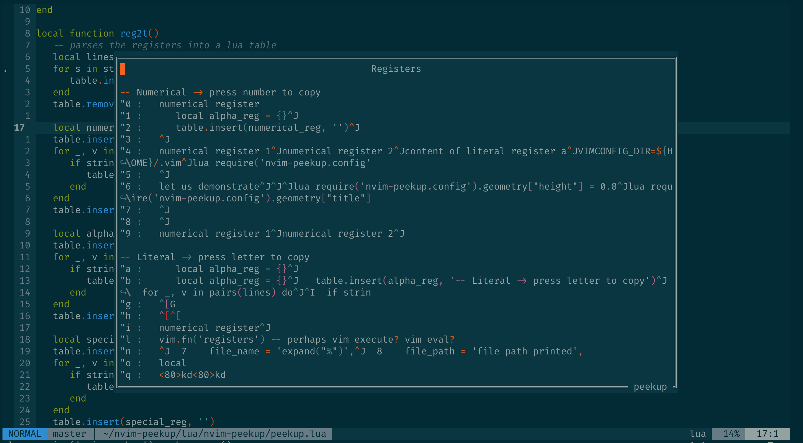

# nvim-peekup
Finally vim registers made easy and fun! No more headaches with cumbersome keystrokes `"<register>p`, no more forgetting where the yanked text is: peek into the vim registers in floating window and pick up the text you want with `nvim-peekup`!



## Installation
Install it using your favourite plugin manager; for instance if you are using vim-plug
```
Plug 'gennaro-tedesco/nvim-peekup'
```
We recommend to use the latest neovim [nightly build](https://github.com/neovim/neovim/releases/tag/nightly), as some lua options may not work otherwise.

## Usage
Open the peekup window with the default keymapping `""`. Scroll and browse the list of registers ordered by type. Select the register you want to copy by simplying pressing the corresponding keystroke character (letter or number, no need to prepend `"`): you receive visual confirmation for your choice and the text is copied into the default register. The peekup window automatically closes and you can now easily put (`p`) your yanked text anywhere you want.

`<Esc>` to manually close the window otherwise.


Default commands

| key           | description
|:------------- |:-------------
|""             | open peekup window
|Esc            | close peekup window
|any charcater  | select and copy text from the corresponding " register
|C-j, C-k       | scroll the list up and down
|arrow keys     | move around in the peekup window

Notice that since characters keystrokes copy the text from the corresponding register, the peekup window does not obey the standard vim motion commands.

## Features in short
- peekup floating window with registers content
- visual confirmation of selected text
- peekup closes automatically, put (`p`) the yanked text anywhere
- fully customisable layout and behaviour

## Customisation
The look and the behaviour of the registers floating window is fully customisable. In order to do so simply override the [dictionary configuration entries](https://github.com/gennaro-tedesco/nvim-peekup/blob/master/lua/nvim-peekup/config.lua) specifying the below in your nvim configurations (init.vim or any other option file being sourced at start-up), say
```
" geometry configuration
lua require('nvim-peekup.config').geometry["height"] = 0.8
lua require('nvim-peekup.config').geometry["title"] = 'An awesome window title'
```
`width` and `height` are to be expressed as ratios of the entire window size, therefore 0 < x < 1.
```
" behaviour of the peekup window on keystroke
lua require('nvim-peekup.config').on_keystroke["delay"] = '300ms'
lua require('nvim-peekup.config').on_keystroke["autoclose"] = false
```
`delay` expresses the delay before the peekup window closes automatically, after selecting the register. Obviously, `autoclose` set to false prevents such behaviour (and the user must close the window manually).

To change default mapping to open the peekup window simply specify the right hand side of
```
let g:peekup_open = '<leader>"'
```

## Help tags
Access the documentation with `:h nvim-peekup`.
